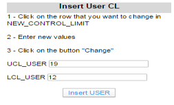

# Presentation du projet : Limites de contrôles

## Auteur : Laurent Cesaro

###### Technologies utilisées :
* TIBCO Spotfire
* Python
* R

###### Objectifs :

Le but de ce projet est de récupérer le moteur de calculs des
limites de contrôles codé en R. Puis utiliser le logiciel de Business
Intelligence Spotfire et d’y implémenter le moteur de calcul.

La deuxième partie est la réalisation d'une application sur Spotfire sous forme de "line story" afin qu'elle soit souple et simple d'utilisation.

###### Limites de contrôles

Les limites de contrôles permettent de déterminer le moment où apparaît une cause particulière de variation d'une caractéristique, entraînant une altération du processus.


###### Point Out Of Control (OOC)

Un point OOC est un point qui dépasse les limites de contrôles, que ce soit la haute
ou la basse limite. 


### Description de l'application

Le projet c’est divisé en 2 sous projets. Un premier projet
a été réalisé avec les données issue de l’usine de Crolles 200mm et un deuxième
avec les données de l’usine Crolles 300mm.

Chaque sous projet se divise en 2 parties. Une partie calcul
des limites de contrôles et une partie visualisation des limites de contrôles
qui sont déjà présentes en base de données.


### Relation entre les tables


1 – Sélection des lots

2 – Chargement des données brutes en fonction des lots précédemment
sélectionnés.

3 – Lancement du script R qui permet le calcul des limites de contrôles et qui
génère 2 nouvelles tables. Une table qui contient les nouvelles limites de
contrôles (New Control Limit) et une deuxième qui contient le nombre d’Out Of
Control par lot Nb OOC/LOT).

4 – Insertion des limites de contrôles par l’utilisateur. Génération de 2
nouvelles tables.

5 – Lancement d’un script R pour le calcul du nombre de point Out Of Control avec
les limites de contrôles entrées par l’utilisateur.

La relation entre 2
tables constitue à définir une ou plusieurs variables communes. Il faut
spécifier une table mère et une table fille. La table fille évoluera en
fonction des données qui sont sélectionnées dans la table mère.


#### Etape 1 : Développement d'un menu
Afin que l'utilisateur puisse se déplacer dans l'application, il a fallu créer un menu qui est présent dans toutes les pages. 
Il a été développé en HTML, CSS et JavaScript.


#### Etape 2 : Sélection des lots
Présenté dans une table, l'utilisateur peut sélectionner des données qui lui serviront à charger de nouvelles données qui seront nécessaire aux calculs.


#### Etape 3 : Chargement des données pour les calculs
La table de sélection des lots et la table des données pour les calculs sont liées par une relation entre 2 variables. Cela permet de charger les données pour les calculs en fonction des données sélectionnées dans l'étape 2.
Le chargement des données se fait à l'aide d'un bouton codé en python.

```
import clr
import System 
import datetime
from Spotfire.Dxp.Data import RowSelection, IndexSet

selection   = IndexSet(dt.RowCount,True)
for r in selection:
   selection[r] = (r<=100)
#delete rows based on selection (rows from indexset marked as true)
dt.RemoveRows(RowSelection(selection))

#Refresh the table that is add in the script parameter
try:
      now = datetime.datetime.now()
      if Document.Properties["CountRowMarked"] > 100:      
            Document.Properties["LotSelection"] = "Too many lots have been selected at : "+str(now.strftime("%Y-%m-%d %H:%M:%S")) + " Maximum 100 lots !"
      else:
            RAW_TABLE.Refresh()
            Document.Properties["LotSelection"]="Data load at:"+str(now.strftime("%Y-%m-%d H:%M:%S")) 
except:
      raise Exception("La table RAW DATA n'a pas pu etre actualisee")
```

#### Etape 4 : Calcul des limites de contrôles
Lorsque les données pour les calculs sont chargées, l'utilisateur peut à l'aide d'un bouton lancer un script R qui lance les calculs.

###### Résultats
Les limites de contrôles calculées sont affichées en noir.


#### Etape 5 : Insertion limites de contrôles par l'utilisateur

Si l'utilisateur veut élargir ou ressérer les limites de contrôles, il peut saisir les siennes manuellement.

Interface de saisie :



Code R pour insérer les nouvelles limites dans la table pour les afficher dans les graphes
```


#Declare 2 news variables
lcl_user<-as.numeric(lcl)
ucl_user<-as.numeric(ucl) 

#Recover the value of parameter and parametertype
param<-param
paramtype<-paramtype

#Create a new dataframe
new<-data.frame("parameter"=param,"parameterType"=paramtype, "USER_LCL"=lcl_user,"USER_UCL"=ucl_user)

#Replace value
output<-rbind(output, new)
#If ducplicated parameter, overwrite first insert by new
output<-output[!duplicated(output[,c("parameter")],fromLast=TRUE),]

#Create a new dataframe with Calculated CL and User CL
NUCL<-Reduce(function(x, y) merge(x, y, all=TRUE),list(output, NCL))
```

###### Résultats utilisateur


#### Etape 6 : Visualisation du nombre de point OOC par lots
Dans cette partie l'utilisateur peur voir le nombre de points OOC qu'il y a par lots.


#### Etape 7 : Recalcul du nombre de point OOC par lots
Lorsque l'utilisateur a fini de saisir ses propres limites de contrôles, il peut recalculer le nombre de ponts OOC par lots.


Code R pour le calcul des OOC utilisateur:
```
#Select column in raw data
RAWDATA<-RAWDATA[,c("LOT","PARAMETER","SITE_VALUE")]
#Rename colmuns
colnames(RAWDATA)<-c("LOT","parameter","SITE_VALUE")

#select column in NEW_CONTROL_LIMIT
NCL<-NCL[,c("parameter","parameterType","LCL","UCL")]

#Merge 3 data.frames (RAW_DATA, NEW_CONTROL_LIMIT, USER_CONTROL_LIMIT)
new<-Reduce(function(x, y) merge(x, y, all=TRUE), list(RAWDATA, NCL, UCL))

#Select only rows with parameterType != NA
new<-subset(new, !is.na(new$parameterType))

#Transform in matrix
newMatrix<-as.matrix(new[,5:8])
for (i in 1:nrow(newMatrix)) {  
    if(is.na(newMatrix[i,3])){    
        newMatrix[i,3]<-newMatrix[i,1]    
        newMatrix[i,4]<-newMatrix[i,2]  }}
        
#Transform matrix in data.frame
newMatrix<-data.frame(newMatrix)
#Merge 
new<-cbind(new[,1:4],newMatrix)
```
